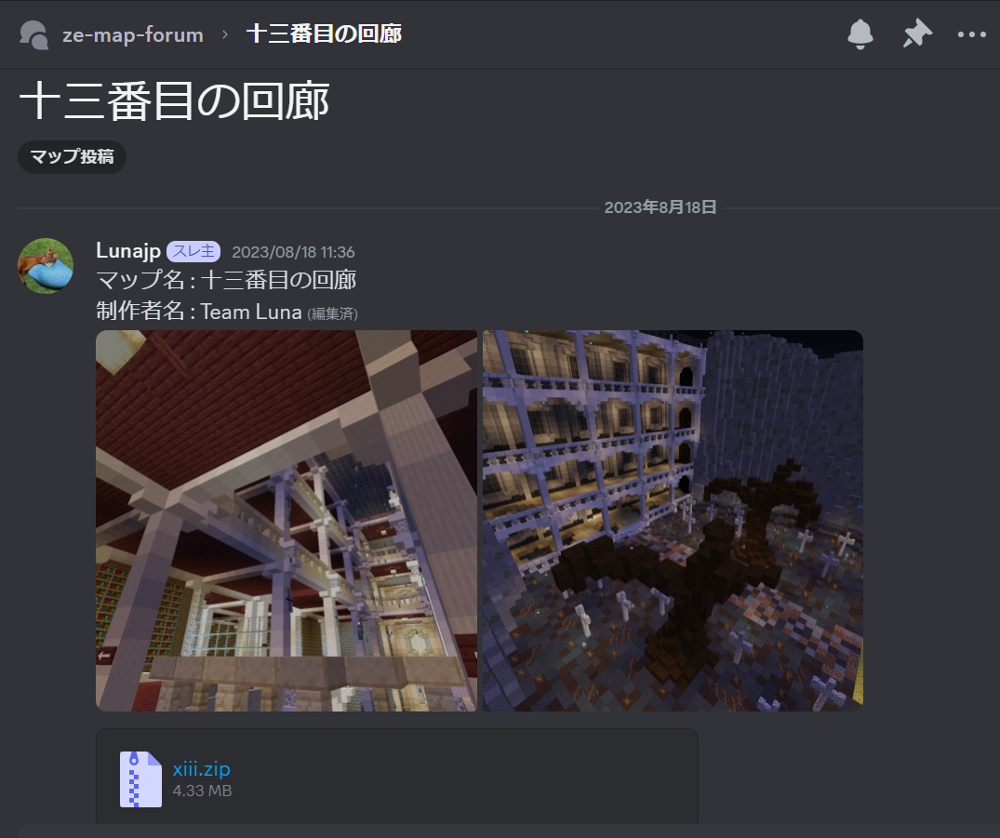

# マップの投稿手順

制作したマップはDiscordに投稿します。以下にマップ投稿の手順を示します。

1. KZEのDiscordのze-map-forumに新しい投稿を作ります。<br>
   右上にある「新しい投稿」のボタンを押します。
2. 「タイトル」を入力します。マップ名と同じにして下さい。
3. 「メッセージを入力…」には「マップ名: (マップ名)」と「制作者名: (制作者名)」の記載の後、マップのスクリーンショット数枚をアップロードします。(適宜改行して下さい。)マップ名・制作者名は[マップ設定.txt](map_setting.md) と同じものを書いて下さい。
4. 続けて[ワールドデータ](world_data.md) をzip形式に圧縮し本文にアップロードします。<br>
   マップデータがdiscordにアップロード出来ないサイズの場合、外部のファイル共有サービスの利用検討をください。
   ```admonish success title = "推奨するファイル共有サービス"
   - [Google Drive](https://drive.google.com/)
   - [Dropbox](https://www.dropbox.com/)
   - [ギガファイル便](https://gigafile.nu/)
   ```
5. マップ投稿の後は、運営スタッフからの連絡を待ってください。<br>
   必要であれば修正箇所の指摘をします。

## マップ投稿例


