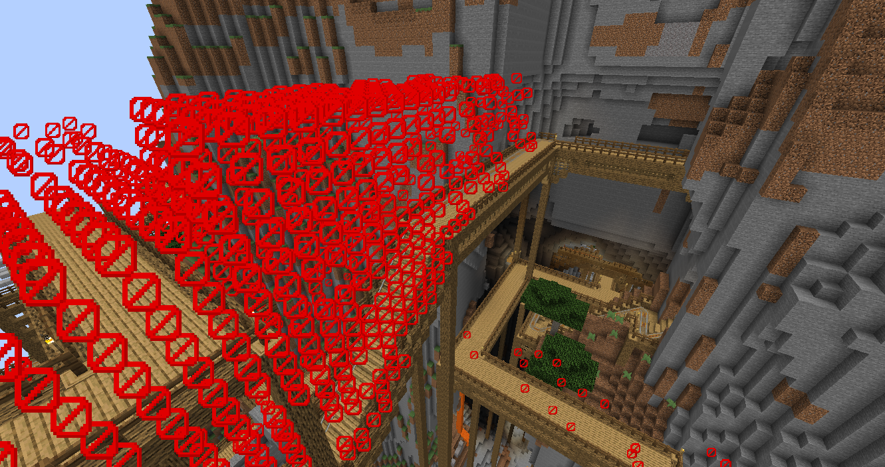
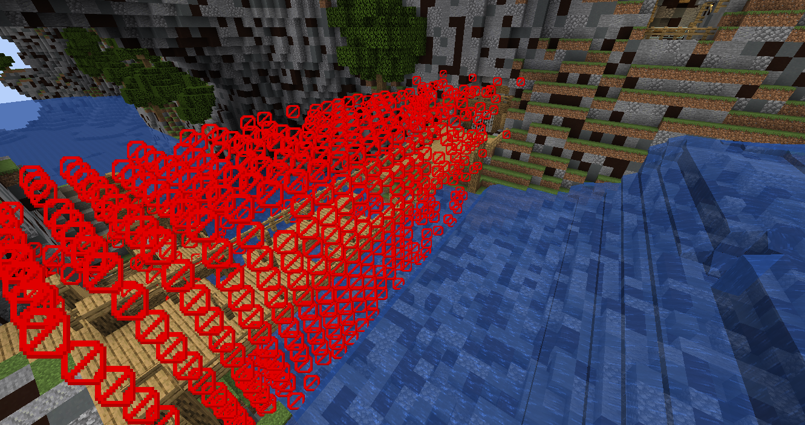

# バリアブロックの配置

プレイヤーがマップの外に出ることがないようにバリアブロックを設置するとができます。

バリアブロックは銃による攻撃を貫通するので、射線を気にしてバリアブロックを配置する必要はありません。

```admonish success title = "推奨例"
- ノックバックを考慮し、高くバリアブロックを設置する
- 天井までバリアブロックを設置する
- バリアブロックで道を塞ぐ時は装飾などでバリアブロックを感じさせないようにする
```

### バリアブロックの配置の例 (Extreme_Hills_cave)



### バリアブロックの配置例(けいりゅう)



## バリアブロックを利用したアスレチックやギミック

バリアブロックの特性を利用したアスレチックやギミック等を作ることができます。

```admonish success title = "推奨例"
- バリアブロックの位置がわかるようにバリアブロックの下にレッドストーントーチを配置する
```

```admonish failure title = "非推奨例"
- 侵入禁止に使用するバリアブロックと混ぜて配置をする
```
