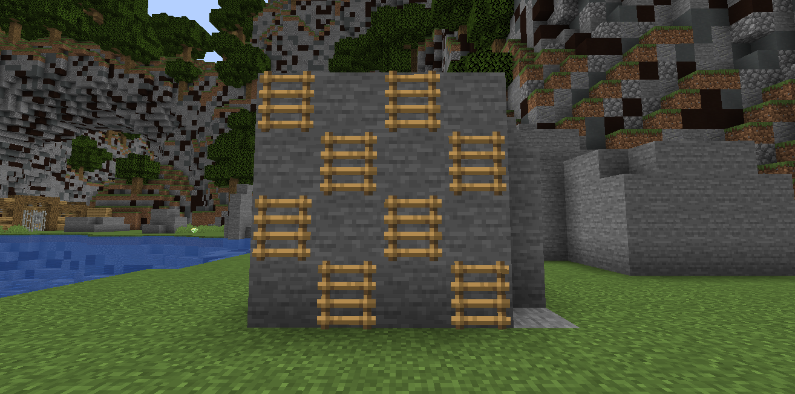

# ハシゴの使用

マップでは通路等にハシゴを使用することができます。

一般的に人間チームが有利な地形になります。

```admonish failure title= "非推奨例"
- 梯子と空気を交互に折り合わせて配置する交互梯子構造
  - 詳細は「交互梯子を使った構造」を参照ください
```

## 交互梯子を使った構造

以下の梯子配置は、確率により登れるか登れないか左右される構造となるため、基本的に禁止としています。



## 関連項目

[アスレチックガイド](./athletic.md)
