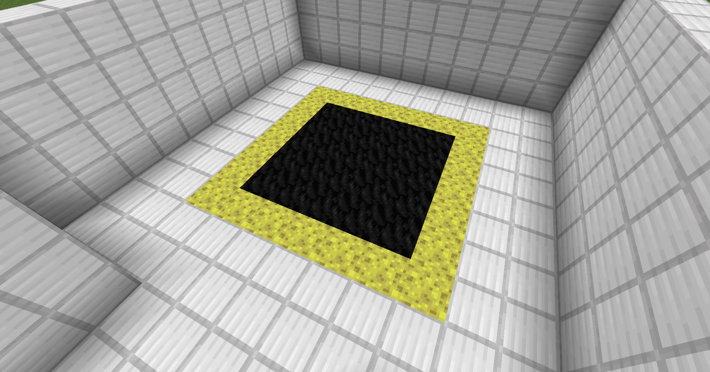

# ゴール地点設定

通常の場合、マップにゴール地点を作る必要があります。<br>
しかし、コマンドでチームの勝利判定を行う場合は脱出地点を作らなくても問題ありません。<br>

([スコアボードのオブジェクト「ZE」](../../game_system/scoreboard_ze.md) 参照)

## ゴール地点の設定

ゴール地点は範囲で指定します。<br>
また、複数箇所を指定することも可能です。<br>

```admonish warning title = "注意事項"
- ゴール地点の範囲の y 座標を 2 ブロック以上にして下さい。
  - 1 ブロックの場合、ジャンプするとゴール地点からはみ出てしまいます。
```

```admonish failure title = "禁止事項"
- スタート地点(人間・ゾンビ)と、ゴール地点の範囲を被らせる設定
```

## ゴール地点のデザイン

脱出地点が何処であるかを一目で判別できるようにして下さい。<br>
慣例上、様々なマップで多用されるスポンジブロックと石炭ブロックの組み合わせが多く使われています。<br>
下記の画像の場合は、スポンジブロックを含めた範囲がゴール地点になります。<br>



```admonish info
マップ独自によるゴール地点のデザインも作成可能です。
```

```admonish failure title = "禁止事項"
- ゴール地点の範囲内に溶岩、水などのブロックが混在した配置
```
