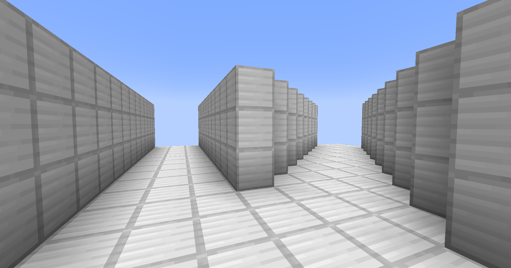
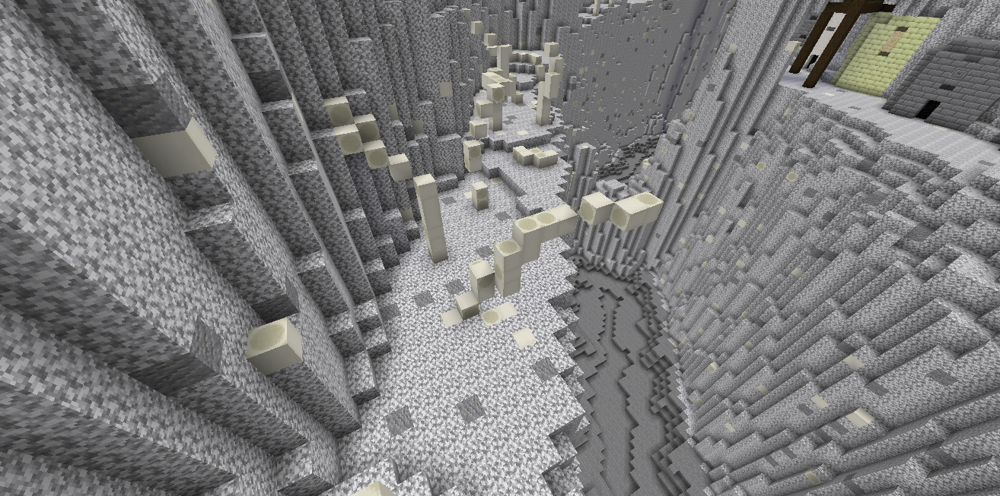
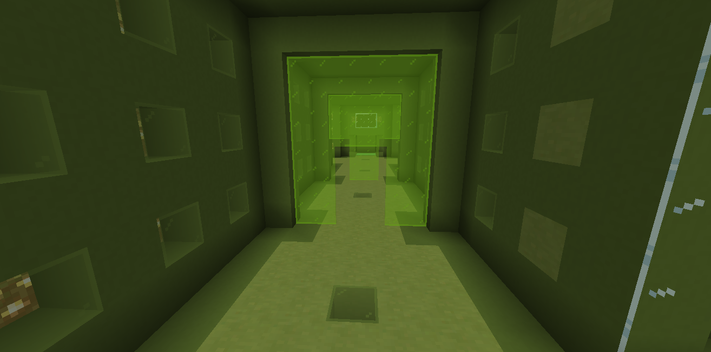

# 通路の作成

人間チームが脱出地点まで向かうまでの、地点と地点を結ぶ経路を 通路 と定義しています。

```admonish success title = "推奨例"
- 最低 3 ブロック以上の道幅
- 上下移動や、曲がり道、ガラスの配置
- 進む先が分かる案内が用意されている - 看板を使う、装飾に織り込む など
```

```admonish failure title = "非推奨例"
- 遠くからでも正面からゾンビを撃つことができる通路構造
  - ゾンビ側が前に進むことができずストレスに繋がるため
```

### 射線を意識した構造について

銃による射撃は発射したプレイヤーから真っ直ぐに射線を作ります。<br>
ゾンビチームはマップ上にある障害物を使い射線を掻い潜りプレイヤーに向かって進攻します。<br>
マップ制作においては、そういった射線を遮る障害物の配置を意識した作りが必要となります。

### 通路幅について

一本道の場合は 5 マス以上の方が多いです。<br>
マップ全体の通路より幅の狭い道にする場合は、複数本のルートを設けておくなどの対策を行う必要があります。<br>

真っ直ぐではない通路を作る際は、単純横幅よりも大きめに作っておく事をお勧めします。<br>

実際の視点で見る際に、構造上の横幅よりも狭くなる場合があるためです。

(添付画像: 3 マス直線通路と 3 マス斜め通路)






